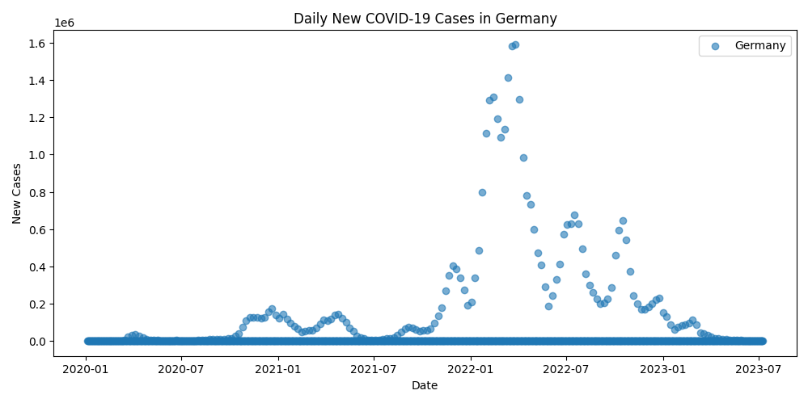
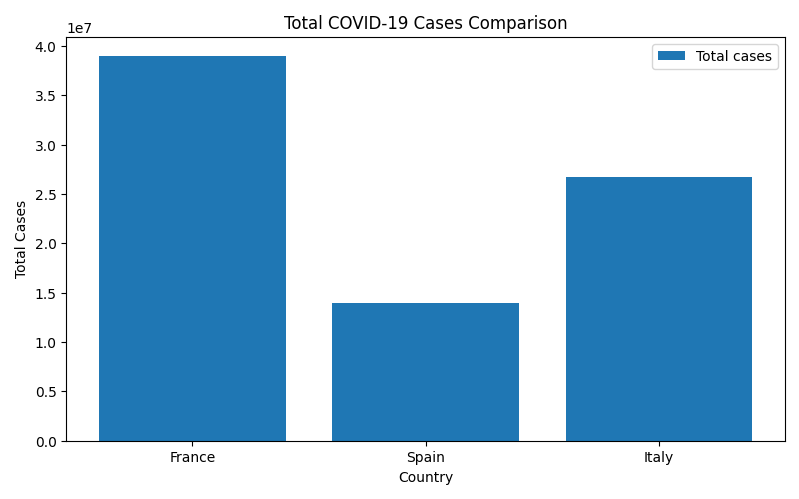

# Report

## Question 1: Recursive Health Index Computation

### What was done
A recursive function was implemented to compute a Health Index H(x) defined by a recurrence relation with a base case H(0) = 0.

### How it was done
The recurrence relation was simplified so that each call computes the value using the previous result H(x-1). Input validation ensures that only non-negative integers are accepted; invalid inputs raise an error.

### Results
`health_index(3) = 12`

---

## Question 2: Class-Based Patient Records

### What was done
A `PatientRecord` class was created to store patient information and health measurements and to compute averages for specific measurements.

### How it was done
The class constructor stores the patient name, age, and measurement dictionary. A static validation method checks that:
- Measurements are stored in a dictionary  
- Each measurement value is a list  
- All elements in the lists are numeric  

The `average_measurement` method computes the mean of a selected measurement and raises an error if the measurement does not exist.

### Results
`Average BP = 122.33`

---

## Question 3: Lambda-Based BMI Classification

### What was done
A function was implemented to classify BMI values into standard categories such as Underweight, Normal, Overweight, and Obesity.

### How it was done
A lambda function was used internally to map BMI values to categories based on standard threshold comparisons. The function processes a list of BMI values and returns a dictionary mapping each value to its category.

### Results
`BMI categories: {16.5: 'Underweight', 22.4: 'Normal', 27.3: 'Overweight', 31.8: 'Obesity'}`

---

## Question 4: Health Data Matrix Analysis

### 4.1 Row and Column Analysis

#### What was done
A function was written to analyze a 2D NumPy matrix by computing:
- The average of the second row  
- The maximum value of the fourth column  

If the matrix does not meet the required size, an informative message is printed.

#### How it was done
NumPy’s built-in mean and max functions were used for numerical stability and clarity. The function checks the matrix dimensions before accessing rows and columns.

#### Results
`analyze_matrix: [ 59.125 130.   ]`

---

### 4.2 Row Transformation

#### What was done
A function was implemented to apply a user-defined transformation to a specific row of a matrix.

#### How it was done
The function accepts a callable transformation and applies it to all elements in the selected row. A lambda function was used to normalize a row by subtracting its mean and dividing by its standard deviation.

#### Results
`row_transform (row 1 normalized):
 [[ 70.           1.75        22.9        120.        ]
 [  0.41896332  -1.15051844  -0.69091317   1.42246829]
 [ 65.           1.6         25.4        110.        ]]`

---

## Question 5: Visualization of COVID-19 Data

### What was done
Real COVID-19 data from *Our World in Data* were used to create:
1. A scatter plot of daily new cases for a single country  
2. A bar chart comparing total cases across three countries  

### How it was done
The dataset was loaded locally using pandas. Matplotlib was used to generate the plots, with appropriate titles, axis labels, and legends. Input validation ensures that exactly three countries are provided for comparison.

### Results

---

## Errors and Issues Encountered

## Errors and Issues Encountered

Several minor issues were encountered during the implementation process. When loading the COVID-19 dataset, a warning appeared due to mixed data types across columns. This occurred because the dataset contains a combination of numeric values, missing entries, and text fields. The issue was resolved by adjusting the data-loading settings, and it did not affect the correctness of the analysis.

In the matrix analysis section, an early version of the code did not check the matrix dimensions before accessing rows and columns, which caused index errors for small test cases. Adding dimension validation prevented these errors and improved robustness.

Finally, when normalizing a matrix row, integer arrays caused unintended truncation of floating-point results. Converting the matrix to floating-point values before applying the transformation resolved this issue.

